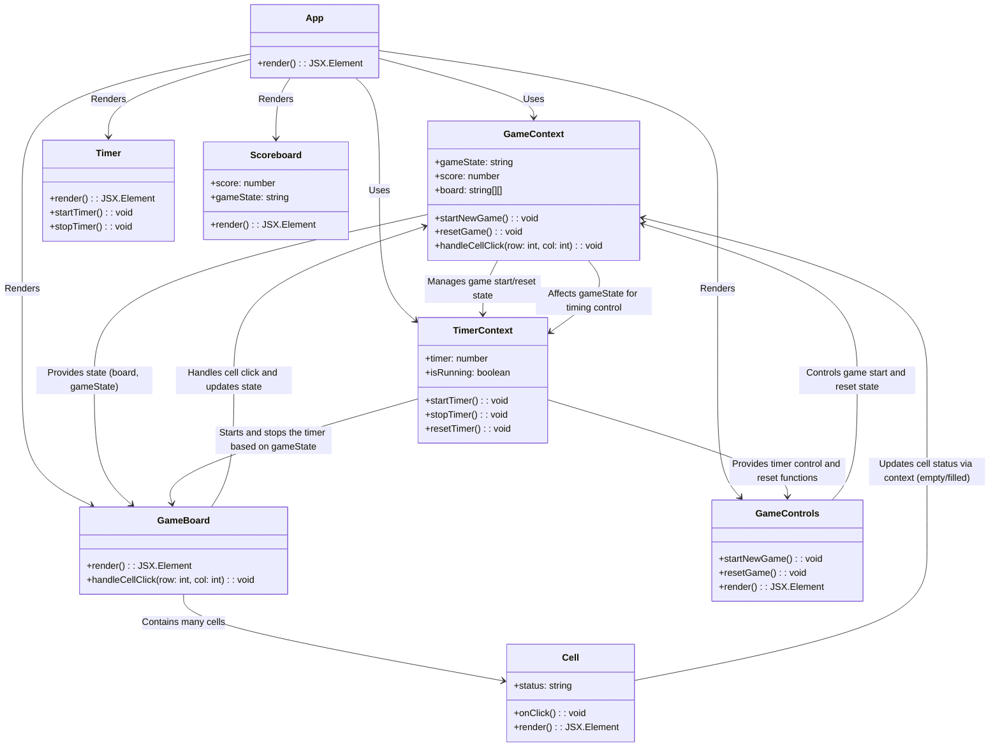

```mermaid
classDiagram
    class App {
        +render(): JSX.Element
    }

    class GameContext {
        +gameState: string
        +score: number
        +board: string[][]
        +startNewGame(): void
        +resetGame(): void
        +handleCellClick(row: int, col: int): void
    }

    class TimerContext {
        +timer: number
        +isRunning: boolean
        +startTimer(): void
        +stopTimer(): void
        +resetTimer(): void
    }

    class GameBoard {
        +render(): JSX.Element
        +handleCellClick(row: int, col: int): void
    }

    class Cell {
        +status: string
        +onClick(): void
        +render(): JSX.Element
    }

    class Timer {
        +render(): JSX.Element
        +startTimer(): void
        +stopTimer(): void
    }

    class Scoreboard {
        +score: number
        +gameState: string
        +render(): JSX.Element
    }

    class GameControls {
        +startNewGame(): void
        +resetGame(): void
        +render(): JSX.Element
    }

    %% Relationships

    App --> GameContext : Uses
    App --> TimerContext : Uses
    App --> GameBoard : Renders
    App --> Timer : Renders
    App --> Scoreboard : Renders
    App --> GameControls : Renders
    
    GameContext --> GameBoard : Provides state (board, gameState)
    GameContext --> TimerContext : Manages game start/reset state
    GameContext --> TimerContext : Affects gameState for timing control

    TimerContext --> GameBoard : Starts and stops the timer based on gameState

    GameBoard --> Cell : Contains many cells
    GameBoard --> GameContext : Handles cell click and updates state

    Cell --> GameContext : Updates cell status via context (empty/filled)
    
    TimerContext --> GameControls : Provides timer control and reset functions
    GameControls --> GameContext : Controls game start and reset state

```